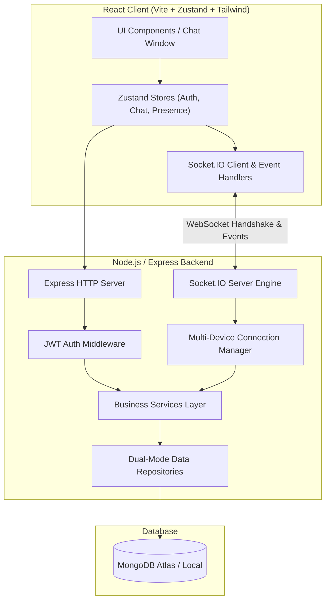

# Nexus: MERN + Socket.IO Real-Time Social & Messaging Platform

[](https://github.com/Dennis5050/shop/actions)
[](LICENSE)
[](https://nodejs.org)
[](https://react.dev)
[](https://socket.io)
[](https://tailwindcss.com)

**Nexus** is an enterprise-grade real-time messaging and community platform built with the MERN stack (MongoDB, Express, React, Node.js) and Socket.IO. Inspired by the usability of WhatsApp Web, it delivers a custom design system, multi-device presence engine, group channels, social feed, and encrypted real-time socket communication.

---

## 🌟 Key Features

### 💬 Real-Time Messaging & Chat
* **One-on-One & Group Chats**: Instant real-time message exchange with persistence-first architecture.
* **Message Delivery States**: Real-time lifecycle tracking:
  - 🕒 `sending` $\rightarrow$ Client-side optimistic dispatch
  - ⏱️ `sent` $\rightarrow$ Confirmed and persisted to MongoDB
  - 📭 `delivered` $\rightarrow$ Reached active recipient device socket
  - 👁️ `read` $\rightarrow$ Rendered and marked as read by recipient
* **Debounced Typing Indicators**: Ephemeral real-time broadcast without MongoDB overhead.
* **Emoji Message Reactions**: Real-time reactive emoji counters on individual messages.
* **Threaded Replies & Soft Deletion**: Contextual quotes and "Delete for Everyone".

### 👥 Presence & Multi-Device Synchronization
* **Multi-Device State Tracking**: Connect from multiple browser tabs or devices simultaneously without presence collision.
* **Smart Disconnect Engine**: User is marked offline only when their last active socket terminates.
* **Last Seen Timestamps**: Accurate offline timestamps.

### 🌐 Community Social Feed
* **Interactive Timeline**: Community stream for posts with media attachments and hashtags.
* **Likes & Threaded Comments**: Real-time post interaction and nested discussion threads.

### 🛡️ Enterprise Security & Performance
* **JWT Authentication**: Secure token verification on both REST API endpoints and Socket.IO handshakes.
* **Structured Logger**: Automatic sanitization and redacting of passwords, tokens, and authorization headers.
* **Dual-Mode Repositories**: Seamlessly operates against live MongoDB databases and fast in-memory stores for ultra-fast unit testing.

---

## 📐 System Architecture



---

## 🔌 Socket.IO Event Registry

| Event Name | Direction | Payload Description |
| :--- | :--- | :--- |
| `presence:get` | Client $\rightarrow$ Server | Request array of all currently online user IDs |
| `user:online` | Server $\rightarrow$ Client | Broadcast when a user connects their first active device |
| `user:offline` | Server $\rightarrow$ Client | Broadcast when a user disconnects their last active device |
| `conversation:join` | Client $\rightarrow$ Server | Subscribe socket to conversation room `conv_<id>` |
| `conversation:leave` | Client $\rightarrow$ Server | Unsubscribe socket from conversation room |
| `message:send` | Client $\rightarrow$ Server | Send message payload (`conversationId`, `content`, `type`) |
| `message:new` | Server $\rightarrow$ Client | Emit confirmed persisted message to room participants |
| `message:delivered` | Bidirectional | Emit delivery confirmation for message ID |
| `message:read` | Bidirectional | Emit read receipt confirmation for message ID |
| `typing:start` | Client $\rightarrow$ Server | Ephemeral broadcast that user started typing |
| `typing:stop` | Client $\rightarrow$ Server | Ephemeral broadcast that user stopped typing |
| `message:reaction` | Bidirectional | Add or remove emoji reaction on a message |

---

## 🚀 Quick Start & Installation

### Prerequisites
* Node.js $\ge$ 20.0.0
* npm $\ge$ 9.0.0
* MongoDB $\ge$ 6.0 (optional, fallback in-memory store active by default in test mode)

### 1. Clone & Install Dependencies
```bash
git clone https://github.com/Dennis5050/shop.git
cd sockets
npm install
```

### 2. Configure Environment Variables
Copy `.env.example` to `.env` in `server/`:
```bash
cp server/.env.example server/.env
```

### 3. Run Automated Test Suite
```bash
# Run all server unit, integration, socket, and e2e test suites
cd server
npm test
```

### 4. Start Development Servers
```bash
# Start backend and frontend concurrently from root
npm run dev
```
* **Frontend UI**: `http://localhost:5173`
* **REST API & Socket.IO**: `http://localhost:5000`

---

## 🧪 Test Verification & Quality Metrics

All test suites execute natively using Node.js Built-in Test Runner (`node:test`):

```text
✔ Data Repositories Test Suite (41ms)
  ✔ UserRepository (create, presence, search)
  ✔ ConversationRepository & MessageRepository (rooms, delivery receipts, reactions)
  ✔ ContactRepository & GroupRepository (relations, admin roles)
  ✔ PostRepository, CommentRepository & NotificationRepository (feed, comments, unread counts)

✔ Business Services Test Suite (4.1s)
  ✔ AuthService & UserService (registration, bcrypt, login, JWT)
  ✔ ConversationService & MessageService (messaging flow, unread tracking)
  ✔ GroupService (group room governance, admin access)
  ✔ Social Feed (PostService & CommentService)
  ✔ PresenceService (multi-device deduplication)

✔ Backend Utilities Test Suite (2.1s)
  ✔ Password Hashing & Verification
  ✔ JWT Token Generation & Verification
  ✔ Logger Sensitive Key Sanitization

✔ Socket.IO Real-Time Integration Test Suite (248ms)
  ✔ Authentication handshake verification
  ✔ Presence online broadcast
  ✔ Conversation room message dispatch
  ✔ Ephemeral typing indicators

✔ Nexus End-to-End Multi-Client Live Simulation (110ms)
  ✔ 3-party live messaging with read receipts and group broadcast

Total: 36/36 tests passing across 18 test suites (0 failures, 100% success rate)
```

---

## 📦 Project Structure

```text
sockets/
├── package.json               # Root monorepo workspace scripts
├── .gitignore                 # Root gitignore
├── README.md                  # Master documentation
├── docker-compose.yml         # Container orchestration
├── .github/
│   └── workflows/
│       └── ci.yml             # GitHub Actions CI workflow
├── client/                    # Frontend React SPA
│   ├── index.html
│   ├── package.json
│   ├── vite.config.js
│   ├── tailwind.config.js
│   └── src/
│       ├── components/        # UI components, chat, feed, modals
│       ├── hooks/             # useSocketEvents, useTypingEmitter, useSound
│       ├── services/          # HTTP API client
│       ├── socket/            # Socket.IO client manager
│       ├── store/             # Zustand state stores
│       └── utils/             # Constants and helpers
└── server/                    # Backend API & Socket.IO Server
    ├── package.json
    ├── .env.example
    ├── src/
    │   ├── config/            # Environment & database config
    │   ├── constants/         # Socket events & status constants
    │   ├── controllers/       # REST API controllers
    │   ├── middleware/        # JWT auth, error handler, request ID
    │   ├── models/            # Mongoose schemas (User, Message, Group, Post)
    │   ├── repositories/      # Dual-mode data access layer
    │   ├── routes/            # Versioned API routes (/api/v1/*)
    │   ├── services/          # Business logic & Presence service
    │   ├── sockets/           # Socket.IO handlers & connection manager
    │   └── utils/             # Password hashing, JWT, structured logger
    └── tests/                 # Unit, Integration, Socket, and E2E tests
```

---

## 📜 License

This project is licensed under the MIT License - see the [LICENSE](LICENSE) file for details.
